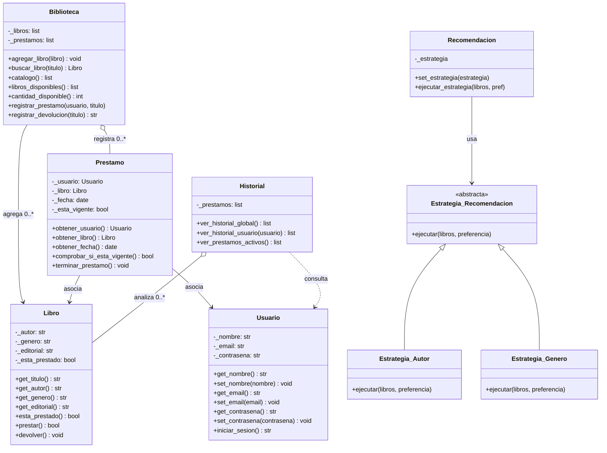

Sistema de Gestión de Biblioteca

Integrantes

Pereyra Joaquín Gabriel
Mateo Joaquín Rivero Correa
Jorge Ordoñez
Aldana Gonzalez

Descripción

Este repositorio contiene un Sistema de Gestión de Biblioteca, en el cual se pueden gestionar usuarios, libros y préstamos. Su función principal es la recomendación de libros: según el contenido que lea cada usuario, se le dan posibles sugerencias.

El proyecto fue desarrollado en Python aplicando el paradigma de Programación Orientada a Objetos, para controlar mejor cada clase y aprovechar la facilidad de codificar con este lenguaje.

Cómo ejecutar

La aplicación se puede usar de dos formas. Las dos comparten las mismas clases; cambia solo la interfaz.

Opción 1 — Interfaz gráfica (recomendada)

La interfaz se abre como una ventana de escritorio local (basada en pywebview). La forma más simple de ejecutarla es con uv, que descarga las librerías necesarias y corre el programa en un solo paso, sin instalar nada de forma permanente:

bashuv run --with pywebview --with werkzeug interfaz_webview.py

El comando se encarga solo de pywebview y werkzeug: no hace falta instalarlos a mano.

Si preferís no usar uv, podés instalar las librerías y ejecutar de la forma clásica:

bashpip install pywebview werkzeug
python interfaz_webview.py

Opción 2 — Aplicación de consola

Versión de menú por terminal, totalmente funcional:

bashpip install werkzeug
python main.py

Al ejecutarla se muestra un menú interactivo:

1. Agregar libro
2. Ver catalogo completo
3. Buscar libro
4. Ver libros disponibles
5. Prestar libro
6. Devolver libro
7. Ver historial global
8. Ver prestamos activos
0. Salir

Se elige una opción escribiendo su número y presionando Enter.

Requisitos

Python 3.10 o superior
Para la interfaz gráfica: pywebview y werkzeug (se instalan solas con el comando uv de arriba).
Para la consola: werkzeug.

Si usás uv, no necesitás instalar nada manualmente. Si en Windows el comando python abre la Microsoft Store, usá py o la ruta completa de tu intérprete.

Estructura del proyecto

ArchivoDescripciónsistema.pyTodas las clases del sistema (Biblioteca, Libro, Usuario, Prestamo, Historial y las estrategias de recomendación). Es el núcleo de la lógica.main.pyAplicación de consola: el menú interactivo. Usa las clases de sistema.py.interfaz_webview.pyInterfaz gráfica de escritorio (ventana local con pywebview). Usa las clases de sistema.py.README.mdEste archivo.

Sobre el diseño

El proyecto aplica los cuatro pilares de la Programación Orientada a Objetos (encapsulamiento, abstracción, herencia y polimorfismo) y el patrón de diseño Strategy para las recomendaciones de libros. Tanto el menú de consola como la interfaz gráfica son capas separadas que solo usan las clases del sistema, sin duplicar lógica: si se cambia una interfaz, las clases no se tocan.
## Diagrama de Clases

